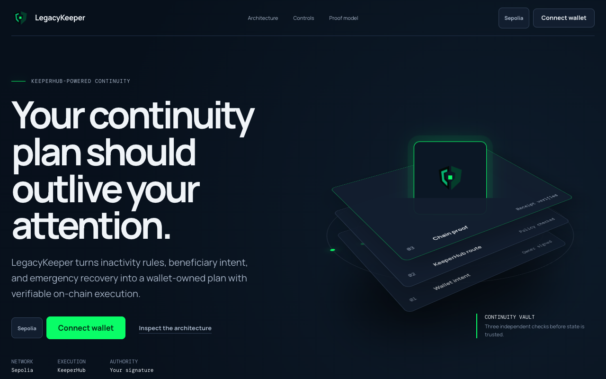
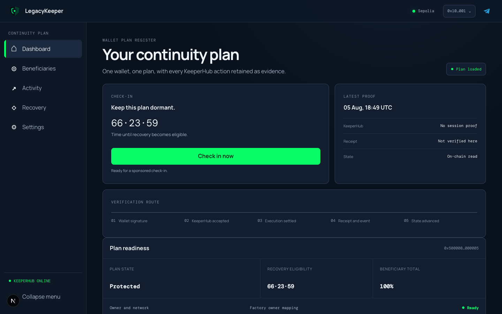
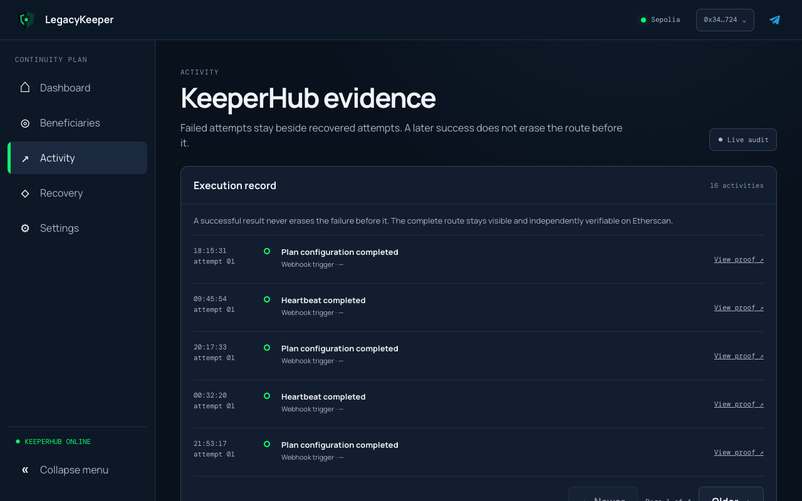
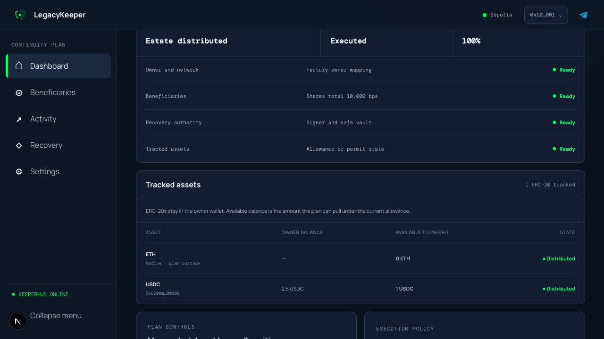

# LegacyKeeper

**Verifiable autonomous continuity agent for self-custodied wallets.**

[](dashboard/package.json)
[](contracts/LegacyKeeper.sol)
[](#verification)
[](https://sepolia.etherscan.io/address/0xf434788C775a36736CF3Ce0D2e0368E22BF9c576)
[](LICENSE)

<p align="center">
  
</p>

LegacyKeeper is a verifiable autonomous continuity agent that monitors wallet liveness, coordinates sponsored execution through KeeperHub, and proves every outcome onchain.

The owner defines the policy. LegacyKeeper observes, decides, acts, and verifies
within those signed constraints. Safety-critical decisions are deterministic by
design: no model can rewrite beneficiaries, bypass recovery authority, or move
assets outside the contract rules.

## Live Demo

[Open LegacyKeeper](https://try-lk.vercel.app) or
[inspect the deployed factory](https://sepolia.etherscan.io/address/0xf434788C775a36736CF3Ce0D2e0368E22BF9c576).

The live release uses Sepolia. Do not connect a wallet that holds mainnet funds.

## Bounty path: first verified transaction

The smallest clean-clone path needs one KeeperHub organization key. It does not
need a deployer key, funded wallet, webhook key, workflow IDs, database, or
Telegram configuration:

```bash
npm ci
KEEPERHUB_API_KEY=kh_your_key_here npm run first-tx
```

The command submits one owner-authorized, sponsored Sepolia `createPlan` call,
then independently verifies the receipt, `PlanCreated` event, factory mapping,
deployed bytecode, owner, and initialization state. Its JSON result includes
the KeeperHub execution ID, transaction hash, Etherscan link, and elapsed time
from MCP handshake to verified proof. See the [one-key quickstart](starter/README.md)
or inspect the request without sending it with `npm run first-tx:dry-run`.

The retained 2026-08-13 benchmark reached independently verified proof in
**74.3 seconds** via sponsored [Sepolia transaction `0x2f39…bbca`](https://sepolia.etherscan.io/tx/0x2f39e73bb20e3cea728da830708e2a2a9f98e590fb0638307ec5afee8025bbca).
See the [sanitized benchmark evidence](reports/first-transaction-benchmark.json).

## Judge Path: One Current-Factory Journey

This is the shortest path through the working product and its evidence:

| Step         | Judge action                                                                                                                                                                        | Proof                                                                                                                                                                                                                                                                                                                                                                                                                                                                                                                                                                                         |
| ------------ | ----------------------------------------------------------------------------------------------------------------------------------------------------------------------------------- | --------------------------------------------------------------------------------------------------------------------------------------------------------------------------------------------------------------------------------------------------------------------------------------------------------------------------------------------------------------------------------------------------------------------------------------------------------------------------------------------------------------------------------------------------------------------------------------------- |
| 1. Create    | Sign one exact EIP-712 continuity policy; the enabled Plan Creation workflow relays `LegacyKeeperFactory.createPlan`                                                                | Current factory [`PlanCreated` transaction `0x4b3904ab`](https://sepolia.etherscan.io/tx/0x4b3904ab94b701cf30433082eed2e08931749956ee8e0d5f8d8405fd3af38a31) registered owner `0x34b0…F724` to plan [`0x652c…5228`](https://sepolia.etherscan.io/address/0x652caD60cd4D0F813e51B9b0cF43BA490EdA5228)                                                                                                                                                                                                                                                                                          |
| 2. Configure | Increase only the grace period from seven to eight days; the enabled Configuration workflow relays the owner-scoped signature                                                       | KeeperHub execution `1bce3s44ha57dy1zg7t7z` produced [`ConfigUpdated` transaction `0x5056f7d8`](https://sepolia.etherscan.io/tx/0x5056f7d8c9d240caaf7ab0602d1ef810efecdbb1bde6279e97248ca9fadf9bdc) and the plan now reads `691200` seconds                                                                                                                                                                                                                                                                                                                                                   |
| 3. Check in  | Sign a heartbeat; the enabled Heartbeat Relay workflow submits it without owner-paid gas                                                                                            | Sponsored [`HeartbeatRecorded` transaction `0xab98f3e1`](https://sepolia.etherscan.io/tx/0xab98f3e1c1e20006fcc4e492bd147dd7e1399cfa4e7580d5436bf1c0d6b554c3) advanced that same plan                                                                                                                                                                                                                                                                                                                                                                                                          |
| 4. Verify    | Open Activity and follow the retained transaction proof                                                                                                                             | LegacyKeeper reports success only when the KeeperHub execution, successful receipt, expected event, current factory mapping, and resulting plan state agree; the complete [configuration evidence](reports/current-factory-configuration-evidence.json) is retained in-repo                                                                                                                                                                                                                                                                                                                   |
| 5. Inherit   | Let the signed inactivity window and grace period expire; a durable per-plan Vercel Workflow wakes at the exact deadline, rereads canonical state, and requests sponsored execution | Two independent current-factory plans have completed inheritance: [`0x1284eeb4`](https://sepolia.etherscan.io/tx/0x1284eeb4deba522d2717e6056921fe31261632c226ab992a81d77922321a3ca9) and [`0xdc96cb02`](https://sepolia.etherscan.io/tx/0xdc96cb02826a18982f4afc5701f59ef5f9155a5ea184e6e1b5292469ec7eec98). The second plan also distributed approved USDC in [`0x13d7dfa6`](https://sepolia.etherscan.io/tx/0x13d7dfa6523afac9095324171da254712de7ee3e1a29b6d55ec76e5e5a279cdd); the complete [inheritance evidence](reports/current-factory-inheritance-evidence.json) is retained in-repo |

The deterministic agent is the safety feature: it observes liveness, evaluates
the owner-signed policy, selects only an allowed action, routes it through
KeeperHub, and rejects incomplete or contradictory proof.

### Submission proof status

| Surface              | Status                                 | Evidence boundary                                                                                                                                                                                                                                                                                |
| -------------------- | -------------------------------------- | ------------------------------------------------------------------------------------------------------------------------------------------------------------------------------------------------------------------------------------------------------------------------------------------------ |
| Wallet-scoped writes | **Four enabled workflows**             | Plan creation, configuration, heartbeat, and evacuation are reproducible from [`wallet-scoped-definitions.ts`](workflows/wallet-scoped-definitions.ts) and their [stored exports](workflows/exported/)                                                                                           |
| Outcome verification | **Fail-closed**                        | No success without execution ID, transaction hash, successful receipt, expected event, registry match, and resulting state                                                                                                                                                                       |
| Liveness monitor     | **Durable per-plan deadline workflow** | Plan creation starts a Vercel Workflow; verified check-ins and configuration changes wake it. It sleeps until `lastHeartbeat + timeoutDuration + gracePeriod`, then rereads the factory mapping and plan state before writing. The UI and GitHub scan remain reconciliation paths, not the clock |
| x402 allowance check | **Settled and consumed**               | The address-bound OneSource result returned after a $0.003 USDC payment on Base: [`0x03376097`](https://basescan.org/tx/0x033760975981b88c5f22755529eec4273bc0a873cfb41589158bdd33141113f5)                                                                                                      |
| MPP                  | **Not demonstrated**                   | The advertised route required an unfunded Tempo account; no funding was authorized                                                                                                                                                                                                               |
| Private routing      | **Not proven**                         | No request parameter or returned route evidence was available, so LegacyKeeper does not claim it was used                                                                                                                                                                                        |

## Product Preview

### Public landing page



### Wallet dashboard



The dashboard capture uses a test-only injected Sepolia wallet connected to the
live current-factory plan.

### Verified activity



Activity retains the public KeeperHub execution ID beside the transaction hash,
gas, trigger, outcome, and timestamp. The latest inheritance receipts, expected
events, factory mapping, token transfers, and resulting state are retained in
the [inheritance evidence report](reports/current-factory-inheritance-evidence.json).

### Inheritance outcome and tracked assets



After inheritance executes, the dashboard replaces check-in controls with the
verified outcome and shows owner balances, pullable amounts, and distribution
state for every tracked asset.

## What Is LegacyKeeper?

LegacyKeeper is a verifiable autonomous continuity agent that gives each owner
wallet one continuity plan. It monitors liveness and evaluates owner-defined
conditions. It coordinates sponsored execution through KeeperHub. It reports
success only after the execution result, transaction receipt, expected event,
factory mapping, and resulting contract state agree.

## Features

- **One plan per wallet.** `LegacyKeeperFactory` verifies the signed setup,
  deploys the plan, and records `planOf(owner)`.
- **Seven-step onboarding.** Network, timing, beneficiaries, recovery, optional
  assets, review/sign, and verified creation live in a fixed-height resumable
  modal.
- **Sponsored liveness.** The owner signs a heartbeat; KeeperHub relays it. A
  plan accepts at most one heartbeat in its owner-configured check-in interval.
- **Editable signed policy.** Beneficiaries, allocations, timing, recovery, and
  tracked assets can be updated after activation without making KeeperHub the
  owner.
- **Fast test configuration.** A zero-day grace period is accepted with an
  explicit warning, so a one-day inactivity plan can become eligible without a
  second recovery delay.
- **Tracked asset ledger.** The dashboard reads native plan custody, owner ERC-20
  balances, current pullable amounts, and per-token distribution state onchain.
- **Inheritance and evacuation.** Inheritance is time-gated and permissionless
  once eligible. After execution, the UI closes check-ins and presents the
  verified outcome. Emergency evacuation requires the separately registered
  recovery wallet.
- **Inheritance execution monitor.** Each plan gets one durable Vercel Workflow
  identified by a deterministic hook token. It sleeps until the signed
  inactivity-plus-grace deadline, wakes immediately after verified policy or
  heartbeat updates, and rereads canonical Sepolia state before KeeperHub is
  allowed to write. Failed executions retry with outcome-aware idempotency keys;
  an open dashboard and the authenticated GitHub scan remain reconciliation
  paths.
- **Wallet-scoped evidence.** Activity is durable in PostgreSQL, filtered to the
  connected owner in the product UI, and displayed five records per page
  without erasing failed attempts that later recover.
- **Private Telegram alerts.** A private Telegram identity is bound to a wallet
  by a one-time bot session plus owner signature. One Telegram account can
  monitor two wallets; each wallet has one active recipient.
- **Telegram recovery entry.** `/evacuate` can open a short-lived recovery page,
  but Telegram never signs or authorizes the transaction. The registered
  recovery wallet still must approve it.

There is no mainnet deployment, subscription, payment, premium tier, group-chat
linking, or Telegram custody in this hackathon release.

## Verified Sepolia evidence

These are real transactions, not illustrative hashes.

| Journey                              | Transaction                                                                                                        | What it proves                                                                                                                                                             |
| ------------------------------------ | ------------------------------------------------------------------------------------------------------------------ | -------------------------------------------------------------------------------------------------------------------------------------------------------------------------- |
| Current-factory signed configuration | [`0x5056f7d8`](https://sepolia.etherscan.io/tx/0x5056f7d8c9d240caaf7ab0602d1ef810efecdbb1bde6279e97248ca9fadf9bdc) | KeeperHub execution `1bce3s44ha57dy1zg7t7z` updated only the grace period; receipt, event, nonce, registry, owner, and post-state agree                                    |
| Wallet-scoped sponsored check-in     | [`0xab98f3e1`](https://sepolia.etherscan.io/tx/0xab98f3e1c1e20006fcc4e492bd147dd7e1399cfa4e7580d5436bf1c0d6b554c3) | Dashboard → KeeperHub → `HeartbeatRecorded`, retained for the owner                                                                                                        |
| Current-factory inheritance 01       | [`0x1284eeb4`](https://sepolia.etherscan.io/tx/0x1284eeb4deba522d2717e6056921fe31261632c226ab992a81d77922321a3ca9) | KeeperHub execution `7c56umll4150i6jd7jqtk` sponsored an elapsed plan and emitted `InheritanceExecuted`; post-state reads `inheritanceExecuted = true`                     |
| Current-factory inheritance 02       | [`0xdc96cb02`](https://sepolia.etherscan.io/tx/0xdc96cb02826a18982f4afc5701f59ef5f9155a5ea184e6e1b5292469ec7eec98) | KeeperHub execution `95ivak6zbksfiw8w3yhad` independently repeated the current-factory path; receipt, event, plan target, and post-state agree                             |
| Current-factory approved USDC split  | [`0x13d7dfa6`](https://sepolia.etherscan.io/tx/0x13d7dfa6523afac9095324171da254712de7ee3e1a29b6d55ec76e5e5a279cdd) | KeeperHub execution `76camga0dxbeqrk48n81l` moved 324 USDC to the 30% beneficiary and 756 USDC to the 70% beneficiary; owner balance is zero and `tokenDistributed = true` |
| Inheritance recovered after failures | [`0x3e8505e2`](https://sepolia.etherscan.io/tx/0x3e8505e2f1bc59d4eb16597dd8dca5a8cc1d1a0525170c8cd55aa60067c351bc) | A later success does not erase the failed route before it                                                                                                                  |
| Exact 60/40 inheritance              | [`0x6efe67a5`](https://sepolia.etherscan.io/tx/0x6efe67a56e725408785e048eb3a7f1a2598ac70e4cdbbdbdc9cd554cd7d12308) | 0.006 and 0.004 ETH delivered                                                                                                                                              |
| Recovery-key evacuation              | [`0x9fe43045`](https://sepolia.etherscan.io/tx/0x9fe43045a93566b7b35f94ab5efc0a9ac39e459f024d12d69e0e2f257bba6ffd) | Recovery key authorized the sweep; owner key was not used                                                                                                                  |
| Sponsored heartbeat                  | [`0x0041106b`](https://sepolia.etherscan.io/tx/0x0041106b3d3f246c57efc27d200a215a07607c4f644c36173826f573da38a598) | KeeperHub paid 83,606 gas                                                                                                                                                  |

The recovered, 60/40, and evacuation proofs predate the wallet-scoped factory
but exercise the same plan contract predicates. The first five rows above use
the current registry, `0xf434788C775a36736CF3Ce0D2e0368E22BF9c576`.

## How It Works

```text
owner or recovery wallet
        │ signs exact EIP-712 intent
        ▼
LegacyKeeper agent ── observes state, evaluates policy, validates action
        │
        ▼
KeeperHub wallet-scoped workflow ── relays contract write on Sepolia
        │
        ▼
receipt + expected event + registry + resulting state
        │
        ├── durable wallet activity
        └── Telegram delivery after verification
```

KeeperHub is load-bearing for product writes, but its acceptance response is
not trusted as completion. API keys remain server-only. The app fails closed if
the execution ID, transaction hash, receipt, event, or state proof is missing.
The durable watcher claims one deterministic owner-plan hook. Each execution
step supplies its Workflow step ID as the KeeperHub idempotency scope. Unknown
outcomes reuse that scope to prevent a second broadcast; only a confirmed
terminal failure can advance to a fresh attempt key.

### Asset custody

- ERC-20 balances remain in the owner wallet. The plan pulls only the available
  allowance when inheritance or evacuation executes.
- Native ETH cannot be pulled from an EOA. Protecting native ETH requires a
  separate explicit deposit into the plan.
- Revoking an ERC-20 allowance removes that token's practical protection until
  the allowance is restored.

### Recovery authority

- The owner cannot replace a registered recovery authority unilaterally.
- A recovery-key rotation requires the current recovery key.
- Telegram can initiate a recovery journey but never receives a reusable
  signature, private key, seed phrase, or transaction authority.

## Application routes

| Route                | Purpose                                                                 |
| -------------------- | ----------------------------------------------------------------------- |
| `/`                  | Public product, proof model, operations, and Telegram security boundary |
| `/dashboard`         | Plan readiness, countdown, configured check-in, and latest proof        |
| `/beneficiaries`     | Beneficiary addresses and exact allocation                              |
| `/activity`          | Owner-scoped KeeperHub attempts and Etherscan proof, five per page      |
| `/recovery`          | Recovery authority, safe vault, and evacuation entry                    |
| `/settings`          | Full-plan review, signed policy updates, assets, and Telegram links     |
| `/recovery/telegram` | Short-lived Telegram recovery entry requiring the recovery wallet       |

Disconnected visitors see the public landing page or a wallet gate, never
another wallet's plan or activity.

## API Reference

All write routes validate exact signed intent and fail closed when KeeperHub or
onchain proof is incomplete. Telegram management routes use short-lived signed
requests or a private, signed wallet-session cookie.

| Method               | Route                                      | Purpose                                                                           |
| -------------------- | ------------------------------------------ | --------------------------------------------------------------------------------- |
| `GET`                | `/api/audit?owner={address}&page={number}` | Return five wallet-scoped activity records per page                               |
| `POST`               | `/api/plans`                               | Verify and relay a signed plan-creation intent                                    |
| `POST`               | `/api/configuration`                       | Verify and relay a signed policy update                                           |
| `POST`               | `/api/heartbeat`                           | Verify and relay the owner's configured check-in                                  |
| `POST`               | `/api/inheritance`                         | Recheck one eligible owner plan and execute native plus tracked-token inheritance |
| `POST`               | `/api/evacuation`                          | Verify and relay recovery-key evacuation                                          |
| `GET`                | `/api/monitor/inheritance`                 | Authenticated scan and verified execution of eligible factory plans               |
| `POST`               | `/api/integrations/keeperhub/events`       | Accept authenticated, verified KeeperHub events                                   |
| `GET`, `POST`        | `/api/telegram/link-sessions`              | Create or inspect a private Telegram link session                                 |
| `GET`, `POST`, `PUT` | `/api/telegram/links`                      | Restore, create, or authenticate a wallet link                                    |
| `POST`               | `/api/telegram/test`                       | Send a signed test notification                                                   |
| `POST`               | `/api/telegram/unlink`                     | Remove a Telegram link after wallet authorization                                 |
| `POST`               | `/api/telegram/webhook`                    | Receive Telegram updates with secret-token validation                             |
| `GET`                | `/api/telegram/evacuation-entry`           | Validate a short-lived recovery entry token                                       |

## Telegram linking and alerts

1. Settings creates a five-minute opaque link session and opens the bot.
2. The webhook accepts only a private chat and records Telegram's immutable user
   ID; usernames are display metadata only.
3. The owner signs `LinkTelegram` typed data naming that Telegram user, wallet,
   chain, nonce, and deadline.
4. PostgreSQL activates the link transactionally, enforcing two wallets per
   Telegram account and one recipient per wallet.
5. A seven-day HttpOnly, Secure, SameSite wallet session restores linked state
   across tabs and deployments without exposing Telegram metadata in browser
   storage.

Bot commands:

- `/wallets`: list linked wallets and notification state.
- `/status`: read monitoring status for a linked plan.
- `/evacuate`: open recovery authorization; the recovery wallet must sign.
- `/unlink`: stop delivery without changing the onchain plan.
- `/help`: explain the security boundary.

Dashboard-originated plan creation, configuration, check-in, and evacuation
notify Telegram only after onchain verification. The current free KeeperHub
workflow tier has no wallet-specific outbound HTTP action, so the four enabled
wallet workflows contain no embedded Telegram recipient or direct Telegram
node. The authenticated integration route is ready for dynamic KeeperHub event
delivery when that action is available.

## KeeperHub workflows

`workflows/wallet-scoped-definitions.ts` is the reproducible source. The stored
platform exports live in `workflows/exported/`.

| Workflow           | Write                                                 |
| ------------------ | ----------------------------------------------------- |
| Plan Creation      | `LegacyKeeperFactory.createPlan`                      |
| Plan Configuration | Signed beneficiary, timing, recovery, or token update |
| Heartbeat Relay    | `LegacyKeeper.heartbeatBySig`                         |
| Panic Evacuation   | `LegacyKeeper.evacuate`                               |

Every plan-specific workflow first rereads `factory.planOf(owner)` and compares
it with the requested plan before relaying the write.

## Smart Contracts

| Contract                                                   | Responsibility                                                                                    |
| ---------------------------------------------------------- | ------------------------------------------------------------------------------------------------- |
| [`LegacyKeeperFactory`](contracts/LegacyKeeperFactory.sol) | Verify the owner's creation signature, deploy one initialized plan, and register `planOf(owner)`  |
| [`LegacyKeeper`](contracts/LegacyKeeper.sol)               | Enforce liveness, inheritance, recovery, asset, and signed-configuration predicates for one owner |

The deployed Sepolia factory is
[`0xf434...c576`](https://sepolia.etherscan.io/address/0xf434788C775a36736CF3Ce0D2e0368E22BF9c576).
Contract tests cover time gates, replay protection, exact allocation,
permissionless inheritance, recovery authority, token behavior, and hostile
beneficiaries.

## Tech Stack

| Layer         | Technology                                                   |
| ------------- | ------------------------------------------------------------ |
| Contracts     | Solidity 0.8.24, Hardhat, EIP-712                            |
| Execution     | KeeperHub MCP and wallet-scoped webhook workflows            |
| Web app       | Next.js 15 App Router, React 19, wagmi, viem, TanStack Query |
| Watcher       | Vercel Workflow DevKit 4.8                                   |
| Data          | PostgreSQL, Drizzle ORM                                      |
| Notifications | Telegram Bot API webhook                                     |
| Tests         | Hardhat, Vitest, Playwright                                  |
| Hosting       | Vercel Functions and hosted PostgreSQL                       |

## Testing the App

1. Open the [production app](https://try-lk.vercel.app).
2. Connect a browser wallet and switch it to Sepolia when prompted.
3. Fund the owner and recovery wallets with test-only Sepolia ETH.
4. Complete onboarding, review the exact plan, and sign its creation intent.
5. Wait for KeeperHub settlement and confirm the registered plan on the
   dashboard or Etherscan.
6. Check in once. The contract blocks another heartbeat for the plan's signed
   check-in interval.
7. Open Settings to link a private Telegram chat, then send a test alert.
8. Open Activity to inspect wallet-scoped attempts and transaction evidence.

Use separate owner and recovery wallets when testing evacuation. Telegram can
open the recovery route, but the registered recovery wallet must authorize the
transaction.

## Running Locally

Requirements: Node.js 20 or 22, npm, a Sepolia RPC URL, testnet-only wallet,
KeeperHub credentials, and PostgreSQL for Telegram/activity features.

```bash
git clone https://github.com/ajanaku1/legacy-keeper.git
cd legacy-keeper
nvm use
npm ci
npm --prefix dashboard ci
cp .env.example .env
```

Set the values in `.env`, then:

```bash
npm run compile
npm run test
npm run test:agent
npm run test:dashboard
npm --prefix dashboard run db:migrate
npm --prefix dashboard run dev
```

Open `http://127.0.0.1:3000`. Wallet writes require Sepolia (`11155111`).

### Environment groups

The full commented template is [.env.example](.env.example).

| Group         | Variables                                                                                                                                                                                                       |
| ------------- | --------------------------------------------------------------------------------------------------------------------------------------------------------------------------------------------------------------- |
| KeeperHub     | `KEEPERHUB_API_KEY`, `KEEPERHUB_WEBHOOK_API_KEY`, four workflow IDs                                                                                                                                             |
| Chain         | `SEPOLIA_RPC_URL`, `NEXT_PUBLIC_LEGACY_KEEPER_FACTORY_ADDRESS`, `NEXT_PUBLIC_LEGACY_KEEPER_LEGACY_FACTORY_ADDRESSES`, `LEGACY_KEEPER_FACTORY_DEPLOYMENT_BLOCK`, `LEGACY_KEEPER_LEGACY_FACTORY_DEPLOYMENT_BLOCK` |
| Deployment    | `DEPLOYER_PRIVATE_KEY`, optional `ETHERSCAN_API_KEY`                                                                                                                                                            |
| Telegram      | `TELEGRAM_BOT_TOKEN`, `TELEGRAM_BOT_USERNAME`, `TELEGRAM_WEBHOOK_SECRET`, `TELEGRAM_ACTION_SECRET`, `TELEGRAM_SESSION_SECRET`                                                                                   |
| Persistence   | `DATABASE_URL`                                                                                                                                                                                                  |
| Public origin | `NEXT_PUBLIC_APP_URL`                                                                                                                                                                                           |
| Event intake  | optional `KEEPERHUB_EVENTS_SECRET`, `LEGACYKEEPER_KEEPERHUB_EVENT_URL`                                                                                                                                          |

Never expose KeeperHub keys, database URLs, Telegram tokens, webhook secrets,
session secrets, or private keys through a `NEXT_PUBLIC_` variable.

## Deployment

### Contracts and workflows

```bash
npm run deploy:sepolia
# Add the printed NEXT_PUBLIC_LEGACY_KEEPER_FACTORY_ADDRESS to .env
npm run workflows:deploy -- --wallet-scoped --enable
```

Enabling workflows changes remote KeeperHub state. Review their exported JSON
before doing so.

### Database and Telegram webhook

```bash
npm --prefix dashboard run db:migrate
curl -X POST "https://api.telegram.org/bot${TELEGRAM_BOT_TOKEN}/setWebhook" \
  -d "url=${NEXT_PUBLIC_APP_URL}/api/telegram/webhook" \
  -d "secret_token=${TELEGRAM_WEBHOOK_SECRET}"
```

Use independent high-entropy values for `TELEGRAM_ACTION_SECRET` and
`TELEGRAM_SESSION_SECRET`; the session secret must be at least 32 bytes.

### Vercel

Configure the production environment variables, then deploy from `dashboard/`
or with the repository's existing Vercel project link. The live deployment is
`https://try-lk.vercel.app`.

The Next.js config is wrapped with `withWorkflow()`, so deployment registers the
internal Workflow flow, step, and hook endpoints. Plan creation starts the
watcher; check-ins and configuration changes resume its deterministic hook.
No cron frequency controls the inheritance deadline.

The five-minute GitHub Action remains a best-effort reconciliation scan. It uses
a short-lived GitHub OIDC token and the route locks issuer, audience, repository,
workflow, event, and branch claims. It is deliberately not described as the
deadline watcher: Scheduled Actions can be delayed and public-repository
schedules can be disabled after inactivity.

## Verification

```bash
./verify.sh
./verify.sh live-inheritance reports/current-factory-inheritance-evidence.json
npm test
npm run test:agent
npm run test:dashboard
npm --prefix dashboard run typecheck
npm --prefix dashboard run build
npm --prefix dashboard run test:e2e
```

The Phase 7 browser gate is:

```bash
npm --prefix dashboard run test:e2e -- e2e/ui-polish.spec.ts
```

The current verified local baseline passes 54 contract tests, 81
KeeperHub-agent tests, 273 dashboard tests, 15 browser tests, and the optimized
Next.js build.
`./verify.sh` is the public repository gate; live-chain claims are checked
separately against Sepolia.

## Troubleshooting

- **Wrong network after the header says Sepolia:** verify the wallet provider's
  actual `eth_chainId`, then use the small Sepolia switch beside Connect.
- **Check-in disabled:** the plan must be active, owner-connected, on Sepolia,
  unsettled, and outside its signed check-in interval.
- **KeeperHub accepted but UI reports failure:** acceptance is not proof. Inspect
  execution result, receipt, expected event, and resulting state.
- **Retry repeats a failure:** reuse the idempotency key while the outcome is
  unknown. Advance to a fresh attempt key only after a confirmed terminal
  failure.
- **Telegram appears disconnected after deployment:** use Manage existing link
  once to create the server wallet session; subsequent tabs and deployments use
  the signed HttpOnly cookie until expiry.
- **Telegram webhook is silent:** confirm the HTTPS URL, secret token, bot token,
  and that the chat is private.
- **Activity is empty:** confirm `DATABASE_URL`, migration state, normalized owner
  address, and that verified routes can write `activity_entries`.

## Project Structure

```text
contracts/                 factory and per-wallet plan contracts
dashboard/app/             public page, application routes, and server APIs
dashboard/components/      landing, shell, onboarding, settings, Telegram UI
dashboard/db/              Drizzle schema and migrations
dashboard/e2e/             wallet, Telegram, and Phase 7 browser journeys
dashboard/lib/             signing, verification, activity, Telegram services
agent/                     fail-closed KeeperHub MCP executor and audit ledger
workflows/                 reproducible definitions and stored platform exports
scripts/                   deployment, workflow lifecycle, smoke and backfill tools
reports/                   historical live evidence, limitations, and threat model
```

## Further documentation

- [Best Onboarding UX Improvement entry](reports/onboarding-bounty-entry.md)
- [One-key first-transaction quickstart](starter/README.md)
- [Clean-clone and production tutorial](starter/docs/tutorial.md)
- [KeeperHub onboarding teardown: first tool call to verified transaction](reports/keeperhub-onboarding-teardown.md)
- [Threat model](reports/threat-model.md)
- [KeeperHub platform coverage](reports/keeperhub-coverage.md)
- [KeeperHub friction reports](reports/friction-log.md)
- [KeeperHub #1841 hosted natural-encoding retest](reports/keeperhub-natural-encoding-evidence.json)

## License

MIT
