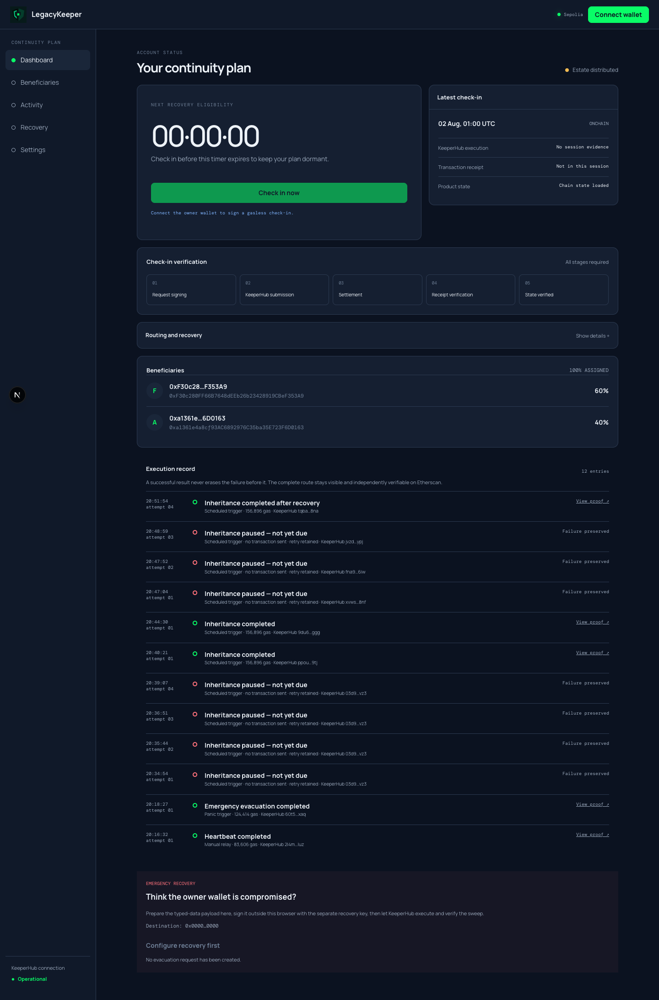

# LegacyKeeper: onchain inheritance and emergency evacuation

An autonomous agent that moves your assets when you cannot: after you go silent, or the moment your wallet is compromised. Execution runs entirely through KeeperHub.

[](https://www.typescriptlang.org/)
[](https://soliditylang.org/)
[]()
[](LICENSE)

## Verified transactions

Every link below is a real Sepolia transaction executed through KeeperHub.

| What | Transaction | Evidence |
|------|-------------|----------|
| Inheritance, recovered after 3 failed attempts | [`0x3e8505e2`](https://sepolia.etherscan.io/tx/0x3e8505e2f1bc59d4eb16597dd8dca5a8cc1d1a0525170c8cd55aa60067c351bc) | 156,896 gas, landed on attempt 4 |
| Inheritance, exact 60/40 split | [`0x6efe67a5`](https://sepolia.etherscan.io/tx/0x6efe67a56e725408785e048eb3a7f1a2598ac70e4cdbbdbdc9cd554cd7d12308) | 0.006 and 0.004 ETH delivered |
| Emergency evacuation | [`0x9fe43045`](https://sepolia.etherscan.io/tx/0x9fe43045a93566b7b35f94ab5efc0a9ac39e459f024d12d69e0e2f257bba6ffd) | recovery key only, owner key unused |
| Gasless heartbeat, sponsored | [`0x0041106b`](https://sepolia.etherscan.io/tx/0x0041106b3d3f246c57efc27d200a215a07607c4f644c36173826f573da38a598) | 83,606 gas, paid by KeeperHub |
| Heartbeat via KeeperHub **Webhook workflow** | [`0x291b7924`](https://sepolia.etherscan.io/tx/0x291b792438560979465254499a4eac55708ee2bc47d44c457ad33e6d83f9c2c3) | automatic run `wrun_01KYZZR8GH2X2FACPB8C59DX7G`, sponsored |

Contract: [`0x0f92268dC069f40e9e6A37BF36dc49D60377f4bA`](https://sepolia.etherscan.io/address/0x0f92268dC069f40e9e6A37BF36dc49D60377f4bA#code), source verified.



Demo video: [watch the 50-second evidence walkthrough](https://github.com/ajanaku1/legacy-keeper/raw/refs/heads/main/video/out/legacykeeper-demo.mp4). It covers the signed heartbeat path, a recovered inheritance run, KeeperHub execution proof, and the paid allowance check.

---

## What is LegacyKeeper?

Two things go wrong with self-custody. You lose access permanently (keys lost, incapacity, death), or someone else gains access and you have minutes to react.

Both need a system that acts without the key in question. LegacyKeeper watches for proof you are alive, and if that proof stops arriving, it distributes your assets to people you named. Separately, a recovery key you keep elsewhere can sweep everything to a safe vault at any moment, even if your wallet key is fully compromised.

The transaction has to fire when nobody is watching. That constraint is the whole product, and it is why execution runs through KeeperHub rather than a script on somebody's laptop.

---

## Features

- **Liveness inheritance.** Configurable timeout and grace period. Miss both, and distribution becomes callable by anyone. The share split is exact to the wei.
- **Emergency evacuation.** Authorized by a separate recovery key. The owner key signs nothing and is never consulted.
- **Assets stay in your wallet.** The contract holds ERC-20 allowances, not balances, and pulls at execution time. You never move funds into it to be protected.
- **Survives hostile recipients.** A beneficiary that reverts on receive, or one frozen by a token blocklist, gets a claimable balance instead of bricking the estate for everyone else.
- **Gasless proof of life.** Sign an EIP-712 heartbeat offline. KeeperHub sponsors the gas, so staying alive never requires a funded wallet.
- **Recovery is visible.** The audit ledger records every attempt, so a failure followed by a success stays in the record rather than being overwritten.
- **Ten verification gates.** A single script decides whether the project is done. It fails on fabricated success values, stub modules, and any direct-RPC transaction send.

---

## Capability matrix

Status is evidence-based. "Live" means a transaction or artifact exists.

| Capability | Status | Evidence |
|---|---|---|
| Inheritance distribution | Live | tx `0x3e8505e2`, `0x6efe67a5` |
| Emergency evacuation | Live | tx `0x9fe43045` |
| Gasless sponsored heartbeat | Live | tx `0x0041106b`, `"sponsored": true` |
| Execution via KeeperHub workflows | Live | 5 enabled workflows, webhook tx `0x291b7924` |
| Schedule, Webhook, Event, Block triggers | Live | automatic executions captured in `reports/live-workflow-evidence.json` |
| Audit trail with retry history | Live | `loop/memory/audit.jsonl` |
| ERC-20 inheritance and evacuation | Live | 36 contract tests |
| Telegram bot and workflow notifications | Live | KeeperHub connection test plus successful Event notification run |
| Dashboard | Live | public chain state, signed KeeperHub heartbeat, receipt and state proof |
| x402 paid allowance monitor | Live | [Base tx `0x03376097`](https://basescan.org/tx/0x033760975981b88c5f22755529eec4273bc0a873cfb41589158bdd33141113f5), $0.003 USDC; exact LegacyKeeper owner/token/spender checked |
| MPP over Tempo | Discovered, blocked | OneSource advertises MPP; AgentCash Tempo balance is $0.00 |
| Private routing | Discovered, unavailable | live schema exposes no request parameter or route receipt |
| Mainnet | Out of scope | Sepolia only |

Private routing is not claimed. The live KeeperHub schema exposes no route
request parameter or receipt, and an onchain preference flag cannot prove how a
transaction was submitted.

The x402 payment is product-linked, not a disconnected payment demo. OneSource
read Circle's Sepolia USDC allowance for the deployed owner's wallet with the
LegacyKeeper contract as spender. The paid result was zero; the app consumed
that result together with the empty tracked-token list and classified ERC-20
coverage as **at risk**. The exact 402 terms, policy ceiling, payment receipt,
retry, response binding, and MPP blocker are in
[`reports/paid-rail-evidence.json`](reports/paid-rail-evidence.json).

---

## Product boundaries

Stated plainly, because each one changes what the product can promise.

**ERC-20 protection lasts only while your allowance stands.** Revoke it and token inheritance silently stops working. Nothing in the system notices on its own, which is why an independent paid allowance check exists.

**Native ETH must be deposited into the contract.** An EOA's balance cannot be pulled by a third party. Tokens stay in your wallet; ETH does not.

**Sponsorship and private routing are different paths.** A transaction is never presented as both.

**Losing the recovery key disables evacuation.** Inheritance still works. Rotation exists, but requires the current key.

---

## Tech stack

| Layer | Technology |
|-------|-----------|
| Contract | Solidity 0.8.24, EIP-712, EIP-2 malleability guard |
| Execution | KeeperHub MCP, workflows, sponsored gas |
| Agent | TypeScript, ethers v6, JSON-RPC over streamable HTTP |
| Dashboard | Next.js 15, wagmi, viem |
| Bot | Telegram Bot API, long polling |
| Tests | Hardhat (36 contract), Vitest (51 agent, 15 dashboard) |
| Payments | x402 over Base USDC |

---

## Environment variables

Copy `.env.example` to `.env`. Keep `.env` untracked.

| Variable | Required for | Notes |
|---|---|---|
| `KEEPERHUB_API_KEY` | MCP and workflow inspection | Organization key with the `kh_` prefix |
| `KEEPERHUB_WEBHOOK_API_KEY` | Dashboard and runner webhooks | User-scoped key with the `wfb_` prefix |
| `SEPOLIA_RPC_URL` | Deployment and independent verification | Alchemy, Infura, or another Sepolia RPC |
| `DEPLOYER_PRIVATE_KEY` | Contract deployment and owner signatures | Testnet burner only |
| `LEGACY_KEEPER_ADDRESS` | Agent and dashboard | Filled after deployment |
| `TELEGRAM_CHAT_ID` | Enabled workflow notifications | KeeperHub must have a Telegram integration |
| `RECOVERY_KEY_ADDRESS` | Emergency setup | Address only; keep the recovery private key elsewhere |
| `SAFE_VAULT_ADDRESS` | Emergency destination | Must not be the compromised owner wallet |

Optional workflow IDs in `.env.example` default to the verified LegacyKeeper
deployment. A new organization receives new IDs when it runs
`npm run workflows:deploy -- --enable`.

## Server routes

| Method | Endpoint | Browser payload | Verified result |
|---|---|---|---|
| `POST` | `/api/heartbeat` | `nonce`, `deadline`, `signature` | KeeperHub execution, sponsored transaction, receipt, event, advanced heartbeat |
| `POST` | `/api/evacuation` | `nonce`, `deadline`, `signature` | Recovery signer, KeeperHub execution, receipt, evacuation event and state |
| `GET` | `/api/audit` | None | Attempt history from the append-only agent ledger |

API keys never cross the browser boundary. Both write routes recover the typed
data signer before they call KeeperHub.

---

## How it works

```
   owner signs                      KeeperHub                     Sepolia
   heartbeat  ──────────────►  ┌──────────────────┐  ────────►  LegacyKeeper
   (offline, no gas)           │  Schedule  cron  │              .heartbeatBySig
                               │  Webhook   panic │
   silence                     │  Event     grace │              .executeInheritance
   30 days ──────────────────► │  Block     health│  ────────►   (permissionless,
                               │                  │               time-gated)
   recovery key                │  smart gas       │
   signs evacuate ───────────► │  retries         │  ────────►   .evacuate
                               │  sponsorship     │               (recovery key only)
                               └──────────────────┘
                                        │
                                        ▼
                                   audit ledger
                          trigger, simulation, tx, gas,
                          outcome, retries, timestamp
```

The contract is permissionless where it matters. `executeInheritance()` can be called by anyone once the grace period expires, because the owner is by definition absent when it must run. Safety comes from the time gate, not from who is asking.

---

## Smart contract

| Function | Access | Purpose |
|----------|--------|---------|
| `heartbeat()` | owner | Emergency contract fallback outside normal product check-ins |
| `heartbeatBySig(nonce, deadline, sig)` | anyone with a valid signature | Gasless relayed heartbeat |
| `executeInheritance()` | anyone, after grace | Distribute native ETH by share |
| `executeInheritanceERC20(token)` | anyone, after grace | Distribute a tracked token |
| `evacuate(nonce, deadline, sig)` | recovery key signature | Sweep everything to the safe vault |
| `rotateRecoveryKey(newKey, ...)` | current recovery key | Rotate without the owner key |
| `claimToken(token)` | beneficiary | Claim a share whose delivery failed |

Every signature is EIP-712, bound to chainId, this contract address, an action-specific typehash, a nonce, and a deadline. A signature for one action cannot authorize another, and one leaked signature cannot drain a second deployment.

---

## Testing the app

Full walkthrough: [`starter/docs/tutorial.md`](starter/docs/tutorial.md). Short version:

```bash
git clone https://github.com/ajanaku1/legacy-keeper.git
cd legacy-keeper
nvm use
./starter/setup.sh              # creates .env on the first run
# Fill the five required values listed by the script.
./starter/setup.sh              # deploys, enables workflows, proves a heartbeat
```

Run everything:

```bash
./verify.sh                     # 10 gates plus phase predicates
npm test                        # 36 contract tests
npm run test:agent              # 51 agent tests
npm run test:dashboard          # 15 dashboard route and boundary tests
npm run agent:bot               # monitor + Telegram
cd dashboard && npm install && npm run dev
```

---

## Verification

`loop/guardrails/verify.sh` has the final say on whether this project is done.

| Gate | Checks |
|------|--------|
| G1 | Contracts compile |
| G2 | 36 contract tests |
| G9 | 51 agent tests against a local fake KeeperHub |
| G6, G7 | Agent and dashboard typecheck; dashboard has 15 focused tests |
| G3 | No fabricated success values or stub modules |
| G8 | A module naming an API actually calls it |
| G4 | No direct-RPC transaction sends |
| G5 | No secret material in tracked files |

G3 and G8 exist because an earlier version of this project shipped a hardcoded transaction hash and a Telegram bot with zero network calls. The gates now fail on both.

---

## For KeeperHub builders

Building this surfaced eight reproducible issues, written up with repros in [`reports/friction-log.md`](reports/friction-log.md). The three that will cost you the most time:

1. **Reusing an `idempotency_key` across retries makes recovery impossible.** KeeperHub caches outcomes including failures and replays them. Scope the key per attempt.
2. **`chain_id`, `function_args` and `gas_limit_multiplier` are string-typed** despite the schema implying otherwise.
3. **`status: "completed"` means settled, not successful.** Read `result.success`.

Platform coverage and what we could not use: [`reports/keeperhub-coverage.md`](reports/keeperhub-coverage.md). Threat model: [`reports/threat-model.md`](reports/threat-model.md).

---

## Project structure

```text
contracts/                 LegacyKeeper contract
agent/                     fail-closed KeeperHub executor, verifier, ledger, payments
bot/                       Telegram command surface
dashboard/                 Next.js action and evidence interface
workflows/                 source definitions, live exports, deployment manifest
scripts/workflows/         workflow lifecycle and reproducible heartbeat runner
starter/                   clean-clone setup script and tutorial
reports/                   live workflow, paid rail, coverage, and friction evidence
test/                      Hardhat and agent reliability suites
verify.sh                  public verification entry point
```

---

## License

MIT
